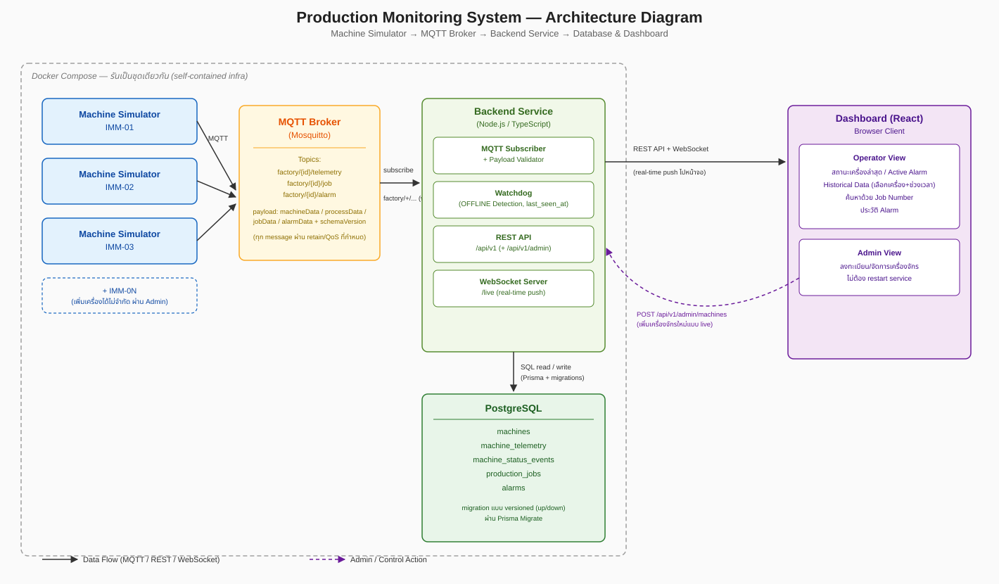
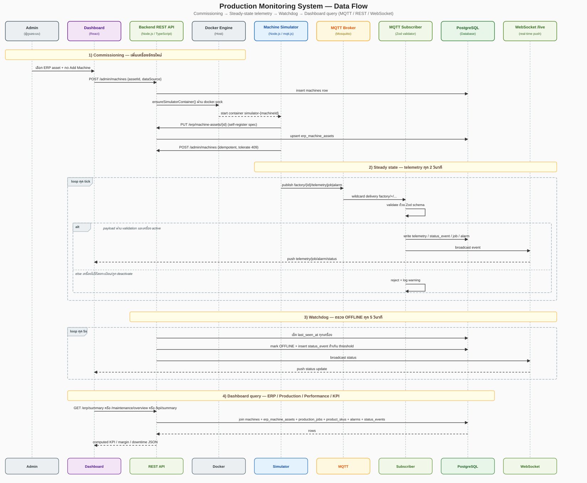
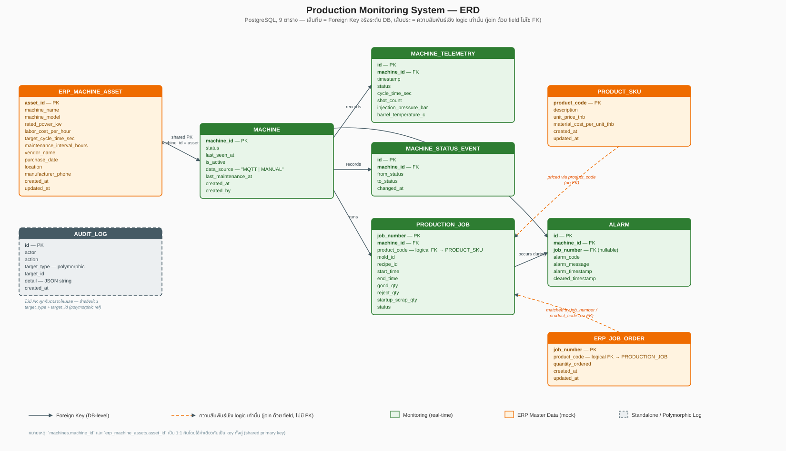

# Production Monitoring

Prototype ระบบ Production Monitoring สำหรับเครื่อง Injection Molding ตามโจทย์ใน [`Direction.md`](Direction.md)

# Table of Contents

- [Assumption](#assumption)
  - [Business](#business)
  - [Technology](#technology)
  - [Field](#field)
- [Solution](#Solution)
  - [สมมติฐานและข้อจำกัด](#สมมติฐานและข้อจำกัด)
  - [Technology ที่เลือกใช้และเหตุผล](#technology-ที่เลือกใช้และเหตุผล)
  - [Architecture Diagram](#architecture-diagram)
  - [Data Flow](#data-flow)
    - [สถานะ (Status) ของเครื่องจักรมีความหมายว่าอะไรบ้าง](#สถานะ-status-ของเครื่องจักรมีความหมายว่าอะไรบ้าง)
  - [Database Structure](#database-structure)
    - [ERD](#erd)
  - [API / Message Format](#api--message-format)
    - [MQTT (Simulator → Backend)](#mqtt-simulator--backend)
    - [REST API (`/api/v1`, Backend → Dashboard)](#rest-api-apiv1-backend--dashboard)
  - [Design Rationale — เหตุผลเชิงลึกเทียบกับทางเลือกอื่น](#design-rationale--เหตุผลเชิงลึกเทียบกับทางเลือกอื่น)
    - [Crosswalk: Design ตอบ Gap ข้อไหนบ้าง](#crosswalk-design-ตอบ-gap-ข้อไหนบ้าง)
  - [แนวทางขยายจาก 3 เครื่องไปยัง 200 เครื่อง](#แนวทางขยายจาก-3-เครื่องไปยัง-200-เครื่อง)
- [Future Vision: สู่ Unmanned (Lights-Out) Operation](#future-vision-สู่-unmanned-lights-out-operation)
- [Quick Start](#quick-start)
- [Ref](#ref)
  - [เอกสารอื่นที่เกี่ยวข้อง](#เอกสารอื่นที่เกี่ยวข้อง)
  - [กรณีศึกษาอ้างอิง — SCG / Nawaplastic Industries (NPI)](#กรณีศึกษาอ้างอิง--scg--nawaplastic-industries-npi)
  - [มาตรฐานอ้างอิงทั้งหมด](#มาตรฐานอ้างอิงทั้งหมด)
  - [โครงสร้าง Repo](#โครงสร้าง-repo)

# Assumption

### Process

1. สภาพโรงงานวันนี้ (As-Is)

โรงงานผลิตข้อต่อ PVC ด้วยเครื่องฉีดพลาสติก (Injection Molding) มีเครื่องจักรราว 200 เครื่อง ผลิตสินค้ากว่า 2,000 SKU พนักงานราว 500 คน ภาพรวมระบบตอนนี้คือ

- เครื่องจักรมาจากหลายยี่ห้อและซื้อมาคนละยุค บางเครื่องใหม่พอเชื่อมต่อข้อมูลได้ บางเครื่องเก่าเชื่อมต่อไม่ได้เลย
- ข้อมูลบางส่วนยังบันทึกด้วยกระดาษหรือ Excel โดยพนักงานเดินไปดูหน้าเครื่องแล้วจดเอง
- มีระบบ IT ขององค์กรอยู่แล้ว (เช่นระบบบัญชี ERP) แต่ไม่ได้เชื่อมกับข้อมูลจากพื้นโรงงานโดยตรง

**ผลกระทบเชิงธุรกิจ**: ผู้บริหารมองไม่เห็นสถานะเครื่องจักรแบบ real-time ต้องรอรายงานสรุปที่คนเดินเก็บข้อมูลมาป้อนเข้าระบบทีหลัง กว่าจะรู้ว่าเครื่องเสียหรือมีปัญหาก็อาจช้าไปหลายชั่วโมง และข้อมูลที่มาจากคนจดมือมีโอกาสผิดพลาดหรือขาดหายสูงกว่าการรับข้อมูลจากเครื่องจักรโดยตรง

โครงการ Production Monitoring นี้คือก้าวแรกที่แก้ปัญหานี้ — ทำให้เห็นสถานะเครื่องจักรและข้อมูลการผลิตแบบ real-time ผ่านหน้าจอเดียว

2. To-Be — จะได้อะไรเพิ่มขึ้นจากตรงนี้

ผู้บริหารและหัวหน้าไลน์เห็นสถานะเครื่องจักรทุกเครื่องพร้อมกันแบบ real-time แทนที่จะรอรายงานสรุปตอนสิ้นกะ รู้ทันทีที่เครื่องจักรมีปัญหาหรือหยุดทำงานโดยไม่ได้วางแผน ลดเวลาที่เครื่องจักรหยุดโดยไม่รู้ตัว (Unplanned Downtime) ข้อมูลที่เคยจดด้วยมือถูกแทนที่ด้วยข้อมูลจากเครื่องจักรโดยตรง ลดความผิดพลาด และค้นหาประวัติการผลิตย้อนหลังด้วย Job Number ได้ทันที

### GAP ที่โจทย์ไม่ได้บอก

| #   | ปัญหาที่พบ | แนวทางแก้ไข / สมมติฐานใน Prototype | [อ้างอิงมาตรฐาน](#มาตรฐานอ้างอิงทั้งหมด) |
| --- | ---------- | ---------------------------------- | ---------------------------------------- |

| **Business** | | | |
| 1.1 | โจทย์ไม่ได้ระบุว่าปัจจุบันวางแผนการผลิต (Production Scheduling) ด้วยระบบใด | Job Number สร้างจากระบบภายนอก (ERP) มาก่อน ระบบ monitoring บันทึกผลเทียบกับ Job ที่มีอยู่แล้วเท่านั้น ระบบจริงต้องมี integration layer เชื่อม MES กับ ERP/Planning | ANSI/ISA-95 (IEC 62264) |
| 1.2 | Injection Molding มี Startup Scrap เสมอ (mold ยังไม่ถึง thermal equilibrium) หากไม่แยกจาก reject ปกติ ตัวเลข Yield Rate จะบิดเบือนในงานสั่งผลิตจำนวนน้อย | แยก field `startup_scrap_qty` ออกจาก reject ทั่วไป — shot แรก 3–5 shot หลัง mold change ถือเป็น purge/startup scrap มาตรฐาน | ไม่มีมาตรฐานสากลกำหนดตัวเลข — เป็น business rule ภายในองค์กร |
| 1.3 | ต้องแยกว่า STOP คือหยุดตามแผนหรือ downtime จริง เพราะต้นทุนการ restart ไม่เท่ากัน (barrel เย็นตัวต้อง warm-up ใหม่) | ใช้ threshold เวลาแยก planned pause ออกจาก downtime event ระบบจริงต้องจำแนก Planned/Unplanned/Changeover | ISO 22400-2 |
| 1.4 | สัดส่วนเครื่องที่เชื่อมต่อได้จริงในบรรดา 200 เครื่องไม่ได้ระบุไว้ หากมีเครื่องเก่าจำนวนมาก dashboard จะมี blind spot ถาวร | Prototype จำลองเฉพาะเครื่องที่เชื่อมต่อได้เต็มรูปแบบตามโจทย์ ระบบจริงต้องมี manual data entry fallback สำหรับเครื่องที่เชื่อมต่อไม่ได้ และมีการบอกสัดส่วนไว้เพิ่มด้วยว่าค่าที่คำนวณนี้มาจากเครื่องทั้งหมดกี่ตัวแบ่งเป็นเครื่องใหม่เครื่องเก่ากี่ % | — |
| 1.5 | การเชื่อมข้อมูลทั้งโรงงานหมายความว่าหากระบบล่ม (เช่นไฟไหม้) การผลิตทั้งหมดเสี่ยง "ตาบอด" | ไม่ implement Disaster Recovery จริงใน Prototype แต่ออกแบบ config ให้รองรับ replication ระบบจริงต้องมี on-site server คู่กับ cloud replica พร้อม DR runbook | ISO 22301 |
| 1.6 | ผู้บริหารต้องการ KPI ที่แปลงจาก raw data แล้ว (Cost per Hour, OEE%, Reject rate, Energy) ไม่ใช่ Cycle Time ดิบ | เผื่อ field `machine_rated_power_kw`, `labor_cost_per_hour`, `target_cycle_time_sec` ใน config ล่วงหน้า เพื่อคำนวณ KPI ได้โดยไม่ต้องแก้ schema — **implement แล้ว** เป็น Executive KPI view (`/kpi`) แยกจาก Operator dashboard | ISO 22400-2 |
| 1.7 | อุตสาหกรรม Injection Molding มี interface มาตรฐานเชื่อมเครื่องจักรกับ MES อยู่แล้ว การออกแบบ schema เองทั้งหมดทำให้เกิดต้นทุน adapter ซ้ำซ้อนเมื่อซื้อเครื่องรุ่นใหม่ที่รองรับมาตรฐานนี้ | Prototype ออกแบบ JSON payload เอง แต่จัดกลุ่ม field ตามแนวคิด `MachineData`/`JobData`/`ProcessData` เพื่อ map ไปมาตรฐานได้ในอนาคต | EUROMAP 77 (เทียบเท่า OPC 40077), IEC 62541 (OPC UA) |
| **Dev** | | | |
| 2.1 | Hardcode รายชื่อเครื่องในโค้ดทำให้การขยายเป็น 200 เครื่องต้อง deploy ใหม่ทุกครั้ง | หน้า Admin เพิ่มเครื่องที่เขียนลง DB ทันทีโดยไม่ต้อง restart service — dynamic MQTT wildcard subscription | — |
| 2.2 | ระบบที่รันคู่กับสายการผลิตจริง deploy พลาดมีต้นทุนสูงกว่าเว็บทั่วไป | ใช้ versioned migration script (up/down) รองรับ rollback ระดับ schema ระบบจริงควรใช้ blue-green deployment หรือ feature flag | — |
| 2.3 | Backup ฐานข้อมูลขนาดใหญ่ระหว่างรับข้อมูล real-time จาก 200 เครื่องพร้อมกัน อาจทำให้ query ช้าลง | ใช้ scheduled `pg_dump` ที่ off-peak hour ใน Prototype ระบบจริงต้องใช้ read replica แยกสำหรับ backup ไม่ให้แย่ง I/O กับ write path หลัก | ISO/IEC 27001 Annex A.12.3 |
| 2.4 | เมื่อเพิ่ม field ใหม่ในอนาคต ต้องไม่ทำให้ consumer เดิมพัง | ออกแบบ payload แบบ additive-only + `schemaVersion` ในทุก payload + API versioning (`/api/v1/`) | — |
| 2.5 | การเปิดใช้ Modbus RTU บน CPU port หนึ่งจะยึด port นั้นทั้งหมด ทำให้ช่างเทคนิคแก้โปรแกรม PLC ผ่านสาย Serial เดิมพร้อมกันไม่ได้ | ระบุ PLC รุ่นที่มีพอร์ตเดียว/สองพอร์ตในเอกสาร วางแผนหน้าต่างเวลาแยกงาน programming ออกจากช่วงเก็บข้อมูล หรือใช้ Ethernet module เสริมแทน | Siemens S7-200 System Manual |
| 2.6 | การอ่านค่าที่เป็น float/double word (เช่น Barrel Temperature) โดยไม่รับประกัน buffer consistency อาจเกิด "torn read" ทำให้ค่าอ่านผิดเพี้ยนแบบสุ่ม | ใช้ Modbus library ที่รับประกัน atomic multi-register read พร้อม sanity check ฝั่ง Backend (ค่ากระโดดเกิน physical limit ให้ flag เป็น suspect) | Modbus Application Protocol Specification |
| 2.7 | Modbus function 03/04/16 อ่าน/เขียนได้สูงสุด 125 holding registers ต่อ 1 request เมื่อเพิ่ม sensor ในอนาคตอาจเกินเพดานนี้ | วางแผน logic แบ่ง (chunking) เป็นหลาย request โดยยังคง cycle time รวมให้อยู่ในเกณฑ์ที่ยอมรับได้ | Modbus Application Protocol Specification |

| **Engineering** | | | |
| 3.1 | Path การ monitoring (PLC → Gateway → MQTT → Dashboard) มีจุดอ่อนที่ยอมรับได้ในงาน monitoring แต่ยอมรับไม่ได้ในงาน safety (network latency, broker ล่ม) | Emergency Shutdown ต้องเป็นวงจร hardwired แยกอิสระ ทำงานแบบ fail-safe ตัดไฟผ่าน safety relay/contactor โดยตรง ระบบ monitoring รับสถานะมา log และแจ้งเตือนเท่านั้น | IEC 60204-1, ISO 13849-1, IEC 62061, EUROMAP 78/78.1 |
| 3.2 | หาก Circuit Breaker ตัดไฟทั้งไลน์ทุกครั้งที่เครื่องเดียวมีปัญหา จะเสียเวลา restart ทุกเครื่องโดยไม่จำเป็น | ทำ selective coordination study (time-current curve) ให้ CB ตัดเฉพาะจุดใกล้ fault ที่สุดก่อน | IEC 60947-2, IEEE 242 |
| 3.3 | สาย Ethernet ทองแดง (Cat5e/Cat6) จำกัดระยะ 100 เมตรต่อ segment โรงงานขนาดใหญ่มักมีระยะเกินนี้ | ใช้ Fiber optic + media converter สำหรับ backbone ระหว่างโซนที่ไกลกัน | IEEE 802.3, TIA/EIA-568 |
| 3.4 | RS-485 (Modbus) แบบไม่มี isolation จำกัดระยะเพียง 50 เมตรต่อ segment | ใช้ RS-485 repeater ขยายได้ถึง 1,000 เมตรต่อ segment เชื่อมต่อกันได้สูงสุด 9 ตัว | TIA/EIA-485-A |
| 3.5 | อุปกรณ์ที่มี reference potential ต่างกันทำให้เกิดกระแสไม่พึงประสงค์ไหลผ่านสายสื่อสาร โดยเฉพาะเครื่องที่ใช้กระแสสูง ทำให้ communication error แบบสุ่ม | ใช้ isolated RS-485 repeater ทุกจุดที่ไม่ได้ใช้ single-point grounding เดียวกัน | IEEE 1100, IEC 61000-5-2 |
| 3.6 | Servo motor/VFD สร้างสัญญาณรบกวนสูง หากเดินสาย signal ขนานกับสายไฟกำลังโดยไม่มี shielding จะเกิด noise | ใช้สาย shielded twisted pair แยก conduit จากสายไฟกำลัง พร้อม single-point grounding | IEC 61000-6-2/6-4 |
| 3.7 | การเพิ่ม I/O module ให้เครื่องเก่าต้องเช็ค power budget (5VDC/24VDC) ของ CPU เดิม | ทำ site survey ก่อน retrofit ทุกเครื่อง คำนวณ power budget ตาม datasheet ก่อนเลือกซื้อ module | Siemens S7-200 System Manual |
| 3.8 | ความสั่นสะเทือนต่อเนื่องจากกลไก clamping/injection ทำให้ terminal แบบ screw หลวมตามเวลา เกิดสัญญาณหลุดเป็นระยะ (false OFFLINE) | ใช้ terminal แบบ spring-loaded ในจุดที่ใกล้แหล่งสั่นสะเทือน | — |
| 3.9 | การซ่อมบำรุงเครื่องเดียวควรทำได้โดยไม่กระทบเครื่องข้างเคียงในไลน์เดียวกัน | ออกแบบ physical isolation (MCCB แบบ withdrawable ที่มีตำแหน่ง ON/OFF/TEST/ISOLATE) ไว้ตั้งแต่ต้น ไม่พึ่ง software toggle อย่างเดียว | IEC 60947-3, ISO 14118 |
| 3.10 | เครือข่ายฝั่ง IT (ERP, Office PC) และ OT (PLC, SCADA) ต้องแยกโซนชัดเจน (ดู [IT กับ OT ต่างกันอย่างไร](#it-ot-convergence)) | วางสถาปัตยกรรมผ่าน Industrial DMZ ตาม Purdue Model | IEC 62443, Purdue Enterprise Reference Architecture |

### Use Case

| Actor                                         | คือใคร                                                                                                          | ใช้งานผ่านหน้าไหน                                                        |
| --------------------------------------------- | --------------------------------------------------------------------------------------------------------------- | ------------------------------------------------------------------------ |
| **Operator**                                  | พนักงานหน้างานที่เฝ้าเครื่องจักร ดูสถานะและค้นหา Job ระหว่างกะ                                                  | Operation, Production                                                    |
| **Chief Operator / Maintenance Lead**         | หัวหน้าไลน์หรือทีมซ่อมบำรุง ดูภาพรวม downtime, บันทึกการซ่อมบำรุง, ลงทะเบียน/เปิดปิดเครื่องจักร                 | Machine Management, Performance, Manual Import                           |
| **Management (ผู้บริหาร)**                    | ผู้บริหารที่ต้องการ KPI สรุปเชิงธุรกิจ ไม่ลงรายละเอียดหน้างาน                                                   | Executive KPI                                                            |
| **ERP / Master Data Officer**                 | เจ้าหน้าที่ดูแลข้อมูลกลางฝั่ง ERP (mock) — สเปคเครื่องจักร, ราคาสินค้า, job order                               | ERP                                                                      |
| **System Admin / IT**                         | ผู้ดูแลระบบ ดูสุขภาพระบบและ audit log, ปรับพารามิเตอร์ simulator สำหรับ demo                                    | Admin, Simulator Tuning                                                  |
| **Machine Simulator** (System Actor)          | ตัวแทนเครื่องจักรจริง/PLC — เรียก API เองตอน commissioning และส่ง telemetry ต่อเนื่อง ไม่ใช่คนกด UI             | ไม่มีหน้า UI — คุยผ่าน MQTT + REST เท่านั้น                              |
| **ERP System (ของจริง)** _(ยังไม่ implement)_ | ระบบ ERP จริงขององค์กร (เช่น SAP/Oracle/Odoo) ที่ในระบบจริงจะเป็นต้นทาง master data แทนหน้า ERP (mock) ปัจจุบัน | — (แสดงเป็นกล่องเส้นประใน [Architecture Diagram](#architecture-diagram)) |

| #     | Use Case                                                            | Actor หลัก                        | รายละเอียด                                                                                                                                                                              |
| ----- | ------------------------------------------------------------------- | --------------------------------- | --------------------------------------------------------------------------------------------------------------------------------------------------------------------------------------- |
| UC-1  | ดูสถานะเครื่องจักรแบบ Real-time                                     | Operator                          | ดูสถานะ (RUN/STOP/ALARM/OFFLINE) ของทุกเครื่องพร้อมกัน อัปเดตสดผ่าน WebSocket ไม่ต้อง refresh                                                                                           |
| UC-2  | รับการแจ้งเตือน Alarm แบบ Real-time                                 | Operator, Chief Operator          | เห็น Alarm ที่ active อยู่ทั้งโรงงานทันทีที่เกิด                                                                                                                                        |
| UC-3  | ค้นหา/ดูรายละเอียด Job การผลิต                                      | Operator                          | ค้นหา Job ด้วย Job Number/เครื่องจักร/SKU ดู qty ดี-เสีย-startup scrap, Mold/Recipe, เทียบยอดสั่งซื้อ (Job Order) กับยอดผลิตได้จริง                                                     |
| UC-4  | ดูประวัติ Telemetry/สถานะย้อนหลังของเครื่องจักร                     | Operator                          | เลือกช่วงเวลาย้อนดู cycle time, pressure, temperature และประวัติเปลี่ยนสถานะของเครื่องหนึ่งเครื่อง                                                                                      |
| UC-5  | นำเข้าข้อมูล Job ด้วยมือ (Manual Fallback)                          | Chief Operator                    | อัปโหลด CSV บันทึกผล Job สำหรับเครื่องที่เชื่อมต่อ MQTT ไม่ได้ (`dataSource=MANUAL`)                                                                                                    |
| UC-6  | ดูภาพรวมการซ่อมบำรุง/ประสิทธิภาพ                                    | Chief Operator / Maintenance Lead | ดู running-hours-since-PM ของแต่ละเครื่อง, downtime breakdown, สรุปตามรุ่นเครื่อง                                                                                                       |
| UC-7  | บันทึกการซ่อมบำรุงเครื่องจักร                                       | Chief Operator / Maintenance Lead | กดยืนยันว่าซ่อมบำรุงแล้ว ระบบ reset ตัวนับ running-hours-since-maintenance ให้อัตโนมัติ                                                                                                 |
| UC-8  | ดู Executive KPI                                                    | Management                        | ดู OEE, Availability/Performance/Quality, Reject Rate, Revenue/Cost/Margin (ต่อ SKU/เครื่องจักร), ประมาณการต้นทุนพลังงาน/แรงงาน ตามช่วงเวลาที่เลือก                                     |
| UC-9  | จัดการ Master Data สเปคเครื่องจักร                                  | ERP Officer                       | เพิ่ม/แก้ไข/ลบ ชื่อ, รุ่น, กำลังไฟ, ต้นทุนแรงงาน, target cycle time, รอบซ่อมบำรุง, vendor ของเครื่องจักรแต่ละเครื่อง (ลบไม่ได้ถ้ายังมีเครื่องผูกอยู่ใน Admin)                           |
| UC-10 | จัดการ Master Data ราคาสินค้า (SKU)                                 | ERP Officer                       | เพิ่ม/แก้ไข/ลบราคาขายและต้นทุนวัตถุดิบต่อหน่วยของแต่ละ SKU                                                                                                                              |
| UC-11 | จัดการ Job Order (mock)                                             | ERP Officer                       | ดู/แก้ไข/เพิ่มยอดสั่งซื้อ (Job Number/SKU/จำนวน) — สร้างอัตโนมัติทุกครั้งที่ job การผลิตเริ่ม ไม่ต้องคีย์มือ แต่แก้ไขเองได้                                                             |
| UC-12 | ลงทะเบียนเครื่องจักรใหม่เข้าระบบ                                    | Chief Operator                    | เลือก ERP asset ที่มีอยู่แล้วมาผูกเป็นเครื่องจักรที่ monitor ได้ — ถ้าเลือก `dataSource=MQTT` ระบบสั่ง start container ของ Simulator ให้อัตโนมัติผ่าน Docker socket                     |
| UC-13 | เปิด/ปิดใช้งานเครื่องจักร                                           | Chief Operator                    | Deactivate เครื่องจักรจะสั่งหยุด container ของ Simulator จริง ไม่ใช่แค่เพิกเฉยข้อมูลที่ยังไหลเข้ามา                                                                                     |
| UC-14 | ตรวจสอบสุขภาพระบบ                                                   | System Admin                      | ดู row count, ขนาด DB, อัตราการไหลเข้าของข้อมูลแบบ real-time เพื่อเช็คว่าระบบยังรับข้อมูลปกติ                                                                                           |
| UC-15 | ตรวจสอบ Audit Log                                                   | System Admin                      | ดูประวัติการกระทำทุกครั้งในหน้า Admin/ERP (ใคร ทำอะไร กับอะไร เมื่อไหร่) เพื่อการตรวจสอบย้อนหลัง                                                                                        |
| UC-16 | ปรับพารามิเตอร์ Simulator แบบ Live                                  | System Admin                      | ปรับความน่าจะเป็น alarm/reject/offline, ช่วง cycle time/pressure/temperature, tick interval, จำนวน startup scrap ของ simulator ที่กำลังรันอยู่ผ่าน MQTT control channel ไม่ต้อง restart |
| UC-17 | Commissioning เครื่องจักรใหม่อัตโนมัติ                              | Machine Simulator                 | ตอน container เริ่มทำงาน เรียก ERP API เพื่อสร้าง/อัปเดต asset ของตัวเอง (พร้อม mock spec ที่สมจริงถ้าเป็นเครื่องใหม่) แล้วเรียก Admin API ลงทะเบียนตัวเองแบบ idempotent                |
| UC-18 | ส่ง Telemetry/Job/Alarm ต่อเนื่อง                                   | Machine Simulator                 | Publish ข้อมูล status, cycle time, pressure, temperature, job (รวม planned qty), alarm ผ่าน MQTT ทุก 2 วินาที ให้ backend เขียนลง DB และ broadcast ต่อ                                  |
| UC-19 | ตรวจจับเครื่องจักร OFFLINE อัตโนมัติ _(ระบบทำเอง ไม่มี Actor คนกด)_ | Backend Watchdog                  | เช็ค `last_seen_at` ทุก 5 วินาที ถ้าเกิน threshold ตั้งสถานะเป็น `OFFLINE` ให้เองโดยไม่ต้องรอเครื่องส่งสัญญาณตัดการเชื่อมต่อ                                                            |

---

# Solution

## Existing Technology

คือส่วนที่คิดว่า เป็นเทคโนโลยีที่เกี่ยวข้องที่จะใช้อ้างอิง เพื่อให้เข้าใจก่อนไปหัวข้อ Technology ที่เลือกใช้และเหตุผล

1. Automation Pyramid — โรงงานมีกี่ "ชั้น" ของระบบ

องค์กรมาตรฐานอุตสาหกรรมนิยามโครงสร้างระบบในโรงงานเป็นลำดับชั้น เรียกว่า ISA-95 หรือ Automation Pyramid ลองนึกภาพเป็นพีระมิด 5 ชั้น จากล่างขึ้นบน

```
      ┌─────────────────────────┐
      │  Level 4: ERP           │  ← วางแผนธุรกิจ, รับ Order ลูกค้า, การเงิน
      ├─────────────────────────┤
      │  Level 3: MES            │  ← วางแผนการผลิต, สั่งงาน, ติดตามคุณภาพ
      ├─────────────────────────┤
      │  Level 2: SCADA/         │  ← "จุดที่โปรเจกต์นี้อยู่"
      │  Supervisory (Monitoring)│     มองเห็นสถานะ, เก็บ log, แจ้งเตือน
      ├─────────────────────────┤
      │  Level 1: PLC/Control    │  ← สมองกลควบคุมเครื่องจักรแบบ real-time
      ├─────────────────────────┤
      │  Level 0: Field/Process  │  ← ตัวเครื่องจักรจริง, เซนเซอร์, มอเตอร์
      └─────────────────────────┘
```

Level 0-1 คือ "ตัวเครื่องจักรกับสมองกลที่คุมมันโดยตรง" (เช่น PLC สั่งฉีดพลาสติกตามพารามิเตอร์ที่ตั้งไว้), Level 2 คือ "จอมอนิเตอร์ที่คนดูสถานะได้" ซึ่งเป็นสิ่งที่ Prototype นี้กำลังสร้าง, Level 3 คือ "ระบบที่วางแผนและสั่งงานการผลิต", Level 4 คือ "ระบบธุรกิจระดับบริษัท" ที่รับคำสั่งซื้อจากลูกค้าและวางแผนภาพรวม

ทำไมต้องแบ่งชั้น: แต่ละชั้นมีความเร็วในการตอบสนองและความเสี่ยงต่างกันมาก Level 0-1 ต้องตอบสนองภายในเสี้ยววินาทีและพลาดไม่ได้เพราะเกี่ยวกับความปลอดภัยของเครื่องจักร ส่วน Level 4 ตอบสนองช้าได้เป็นนาทีหรือชั่วโมงก็ไม่เป็นไร การผสมสองชั้นนี้เข้าด้วยกันแบบไม่ระวังคือจุดเริ่มต้นของปัญหาความปลอดภัยและความน่าเชื่อถือของระบบ

ระบบนี้คือฐานราก (Level 2) ที่จำเป็นต้องมีก่อน ถ้าในอนาคตอยากขยับขึ้นไปสู่การวางแผนการผลิตอัตโนมัติ (Level 3) หรือแม้แต่วิสัยทัศน์ระยะยาวอย่างโรงงานที่ทำงานได้เองโดยแทบไม่ต้องมีคนควบคุมตลอดเวลา (ดูหัวข้อ [Future Vision](#future-vision-สู่-unmanned-lights-out-operation) ด้านล่าง) เพราะไม่มีทางขยับขึ้นชั้นบนได้เลยถ้าชั้นล่างยังมองไม่เห็นข้อมูลที่แม่นยำและ real-time

2. ข้อมูลเดินทางอย่างไร — 3 ระดับของการสื่อสาร

| ระดับ                      | ใช้เชื่อมอะไรกับอะไร                | โปรโตคอลที่ใช้        | หลักการทำงานแบบง่าย                                                                                                                  |
| -------------------------- | ----------------------------------- | --------------------- | ------------------------------------------------------------------------------------------------------------------------------------ |
| **Field Level**            | เซนเซอร์/มอเตอร์ ↔ PLC              | Modbus (RTU หรือ TCP) | PLC "ถามซ้ำๆ" ไปที่เซนเซอร์ทุกรอบเวลาสั้นๆ (เหมือนถามซ้ำทุกเสี้ยววินาที)                                                             |
| **IoT / Monitoring Level** | PLC/เครื่องจักร ↔ ระบบกลาง (Broker) | MQTT                  | อุปกรณ์ "ประกาศ" ข้อมูลเมื่อมีเหตุการณ์/ค่าเปลี่ยน โดยไม่ต้องมีใครมาถามก่อน เหมือนประกาศทางวิทยุ ใครอยากฟังก็ "สมัครฟัง" ช่องนั้นเอง |
| **Enterprise Level**       | MES/ERP ↔ Server ส่วนกลาง           | REST API / GraphQL    | ระบบหนึ่งขอข้อมูลจากอีกระบบเป็นครั้งๆ ไป เหมือนโทรศัพท์ถามคำถามแล้ววางสาย                                                            |

ทำไมไม่ใช้วิธีเดียวกันทั้งหมด — Modbus เร็วมากแต่ใช้ได้แค่ในสายไฟ/เครือข่ายเฉพาะที่ระยะใกล้ MQTT เหมาะกับข้อมูลจำนวนมากจากอุปกรณ์หลายพันตัวขึ้นไปบน Cloud โดยประหยัดทรัพยากร REST API เหมาะกับให้ระบบธุรกิจ "ขอข้อมูลสรุป" เป็นครั้งคราวมากกว่าข้อมูลดิบรัวๆ ตลอดเวลา

Prototype นี้ใช้ MQTT (payload format จำลองตามที่ระบุใน [API / Message Format](#api--message-format))
เชื่อม Machine Simulator กับระบบกลาง แล้วใช้ REST API เชื่อมระบบกลางกับ Dashboard — ตรงตามระดับ IoT/Monitoring และ Enterprise ในตารางข้างต้น

> **GAP ข้อ 2.5–2.7 เป็น Future Scope** เกี่ยวข้องกับตอนเชื่อมต่อ PLC จริงผ่าน Modbus เท่านั้น ไม่ใช่ส่วนหนึ่งของ Prototype ปัจจุบัน เพราะ Machine Simulator สวมบทบาทแทน PLC ทั้งก้อน จึงข้ามขั้นตอน "PLC poll ค่าจาก sensor ผ่าน Modbus" ไป — สร้างค่า Cycle Time/Pressure/Temperature เองแล้ว publish ผ่าน MQTT โดยตรง ไม่มี Modbus ปรากฏในโค้ด Prototype เลย สามข้อนี้แสดงความเข้าใจ pipeline ทั้งสายสำหรับตอนขยายไปเชื่อมเครื่องจักรจริง

<a id="it-ot-convergence"></a>

3. IT กับ OT ต่างกันอย่างไร และทำไมต้อง "Convergence"

**OT (Operational Technology)** คือระบบที่ควบคุมเครื่องจักรและกระบวนการผลิตโดยตรง เช่น PLC, SCADA หัวใจสำคัญคือ "ต้องทำงานต่อเนื่องได้และปลอดภัย" (Availability & Safety)

**IT (Information Technology)** คือระบบคอมพิวเตอร์สำนักงานทั่วไป เช่น อีเมล ระบบบัญชี ฐานข้อมูลลูกค้า หัวใจสำคัญคือ "ความลับของข้อมูล" (Confidentiality) และอัปเดตซอฟต์แวร์บ่อยๆ ได้โดยไม่กระทบใคร

สองโลกนี้แต่เดิมแยกกันเด็ดขาด แต่ทุกวันนี้ธุรกิจต้องการให้ผู้บริหารเห็นข้อมูลจากพื้นโรงงาน (OT) มาแสดงบนแดชบอร์ดฝั่งสำนักงาน (IT) ได้ — นี่คือที่มาของ **IT/OT Convergence**: "เชื่อมข้อมูล" สองโลกเข้าด้วยกันโดยไม่ทำลายคุณสมบัติสำคัญของแต่ละฝั่ง

วิธีที่อุตสาหกรรมทำกันคือกั้นโซนกลางเรียกว่า **Industrial DMZ** เปรียบเหมือนด่านตรวจกลางที่ข้อมูลจาก OT ต้องผ่านมาพักไว้ก่อน แล้วฝั่ง IT ค่อยมาดึงข้อมูลจากด่านนี้ แทนที่จะให้คอมพิวเตอร์สำนักงานเชื่อมตรงเข้าไปคุยกับเครื่องจักรเลย ระบบ Monitoring นี้ถูกออกแบบให้อยู่ในตำแหน่งด่านตรวจนี้พอดี — รับข้อมูลจากเครื่องจักรมาเก็บ แล้วให้ฝั่งบริหารมาดูผ่าน Dashboard อีกที ไม่เปิดให้ฝั่งสำนักงานเข้าไปยุ่งกับเครื่องจักรโดยตรง

## Technology ที่เลือกใช้และเหตุผล

| ส่วน              | เทคโนโลยี                                    | ทำไม                                                                                                                                                                                                                                                                                                                                                                                                                                                                                                                                            |
| ----------------- | -------------------------------------------- | ----------------------------------------------------------------------------------------------------------------------------------------------------------------------------------------------------------------------------------------------------------------------------------------------------------------------------------------------------------------------------------------------------------------------------------------------------------------------------------------------------------------------------------------------- |
| Machine Simulator | Node.js + `mqtt.js` (TypeScript)             | เขียนสั้น เชื่อม MQTT ตรงไปตรงมา, ใช้ runtime เดียวกับ backend ลด context switch                                                                                                                                                                                                                                                                                                                                                                                                                                                                |
| Message Broker    | Mosquitto (MQTT)                             | event-driven แทน REST polling — latency ต่ำกว่า, จำลอง OFFLINE ได้เนียนด้วยการหยุด publish ตรงๆ, เป็น pattern มาตรฐานของ IIoT MQTT (pub/sub) แทน REST polling — event-driven ไม่ต้องยิง request รัวๆ, latency ต่ำกว่า, จำลอง OFFLINE ได้เนียนกว่าด้วยการหยุด publish ตรงๆ, เป็น pattern มาตรฐานของ IIoT ที่ตรงกับหัวข้อ "พิจารณาเป็นพิเศษ" ในเกณฑ์ประเมิน ข้อเสีย: ต้องดูแล broker เพิ่มหนึ่งตัว และ debug ยากกว่า REST ตรงที่ทดสอบด้วย curl ตรงๆ ไม่ได้ ต้องมี MQTT client ช่วย                                                                |
| Backend           | Node.js + TypeScript + Express               | type-safe, ecosystem MQTT/WebSocket ครบ, ทีมเล็กดูแลง่าย                                                                                                                                                                                                                                                                                                                                                                                                                                                                                        |
| Validation        | Zod                                          | validate payload จาก MQTT/REST ก่อนเข้า DB แบบ type-safe                                                                                                                                                                                                                                                                                                                                                                                                                                                                                        |
| ORM / Migration   | Prisma                                       | migration แบบ versioned (up/down) commit เข้า repo ได้ — สำคัญเพราะระบบรันคู่กับสายการผลิตจริง deploy พลาดมีต้นทุนสูง Migration tool แบบ versioned (up/down) แทนการรัน SQL ALTER สดตอน deploy — ระบบที่รันคู่กับสายการผลิตจริง deploy พลาดมีต้นทุนสูง การมี rollback path ที่ทดสอบแล้วจึงจำเป็นกว่าเว็บทั่วไป ข้อเสีย: ต้องเรียนรู้ syntax ของ migration tool เพิ่ม                                                                                                                                                                             |
| Database          | PostgreSQL เดียว (ไม่ใช้ time-series DB แยก) | ที่ระดับ 3-10 เครื่อง ข้อมูลยังน้อย DB เดียวดูแลง่ายกว่าและ join กับ job/alarm ได้สะดวก — ดูหัวข้อ [scaling ไป 200 เครื่อง](#แนวทางขยายจาก-3-เครื่องไปยัง-200-เครื่อง) PostgreSQL เดียวเก็บทั้ง telemetry และข้อมูลเชิงสัมพันธ์ แทน time-series DB เฉพาะทาง (Influx/Timescale) — ที่ระดับ 3-10 เครื่อง ข้อมูลยังน้อย DB เดียวดูแลง่ายกว่าและ join กับ job/alarm ได้สะดวก ข้อเสีย: ถ้าขยายไป 200 เครื่องจริงตาราง telemetry จะโตเร็ว ต้อง partitioning หรือย้ายไป TimescaleDB (เป็น extension บน Postgres ย้ายทีหลังได้โดยแทบไม่แก้โค้ด backend) |
| Real-time push    | WebSocket (`ws`)                             | ให้ dashboard อัปเดตสดตอน demo (เครื่องเปลี่ยน ALARM ปุ๊บ จอเปลี่ยนปั๊บ) แทนที่จะ poll REST เอง                                                                                                                                                                                                                                                                                                                                                                                                                                                 |
| Dashboard         | React + Vite + TypeScript                    | เขียนเร็ว, HMR ระหว่าง dev, type-safe ร่วมกับ backend ผ่าน shared payload shape                                                                                                                                                                                                                                                                                                                                                                                                                                                                 |

---

## Architecture Diagram

อัปเดตหลังเพิ่มระบบ ERP (mock) — เดิมมีแค่ `machines` เก็บทั้งสถานะและสเปคเครื่องจักรในตัวเดียว ตอนนี้แยกฝั่ง Level 4 (ERP: `erp_machine_assets` + `product_skus`) ออกจาก Level 2 (`machines` เหลือแค่สถานะการเชื่อมต่อ) ชัดเจนขึ้น พร้อมเพิ่มหน้า ERP / Machine Management (maintenance) ทางฝั่ง Dashboard และให้ Backend เป็นคนคุม lifecycle ของ Simulator container เองผ่าน Docker socket



**สิ่งที่เปลี่ยนจากเดิม**: (1) `erp_machine_assets`/`product_skus` แยกออกมาเป็น Level 4 (ERP mock) ของตัวเอง ไม่ผูกอยู่ใน `machines` อีกต่อไป (2) Backend เพิ่ม `simulatorManager.ts` คุม container ของ Simulator ตรงผ่าน Docker socket แทนให้ผู้ใช้รัน `docker compose run` เอง (3) Simulator เรียก ERP API เพื่อ self-register asset ของตัวเองก่อนเรียก Admin API (4) Dashboard เพิ่มหน้า ERP และ Chief Operator, ยุบ System Health เข้า Admin

**เรื่องถัง ERP ใน Postgres**: กล่อง `ERP System (ของจริง)` ในรูปคือของสมมติ — องค์กรจริงจะมีระบบ ERP (SAP/Oracle/Odoo ฯลฯ) แยกเป็นของตัวเอง เก็บ master data เครื่องจักรและราคา SKU อยู่ฝั่งนั้น **ใน Prototype นี้ไม่มี ERP จริงให้เชื่อม** จึงจำลองด้วยการเก็บ `erp_machine_assets`/`product_skus` ไว้ใน PostgreSQL ถังเดียวกับข้อมูล Monitoring เลย (เข้าถึงผ่าน `erp.ts` เหมือนเป็นคนละระบบในทาง API แต่ physically เป็น DB เดียวกัน) — **ในระบบจริง** จุดนี้จะเปลี่ยนเป็น integration adapter ที่ sync/pull master data จากระบบ ERP จริงเข้ามา cache ไว้ฝั่ง Monitoring แทนที่จะให้ผู้ใช้แก้ไขราคา/สเปคเครื่องจักรตรงในหน้า ERP (mock) ของระบบนี้เอง

---

## Data Flow

ลำดับการไหลของข้อมูลตั้งแต่ commissioning เครื่องใหม่ไปจนถึงข้อมูลขึ้นจอ ครอบคลุมทั้ง 3 เส้นทางหลัก: MQTT (steady-state telemetry), REST (commissioning + query), และ WebSocket (real-time push)



> Note

- เครื่องจักรต้องมี asset record ใน ERP ก่อนเสมอ แล้วลงทะเบียนผ่าน Admin API ก่อนเสมอ ระบบจะไม่ auto-register จาก MQTT — Simulator เรียก ERP API เพื่อสร้าง/อัปเดต asset ของตัวเองแล้วเรียก Admin API เพื่อลงทะเบียนตอนเริ่มทำงาน จำลองขั้นตอน commissioning ของช่างเทคนิคจริงที่เครื่องมักถูกบันทึกไว้ใน ERP อยู่ก่อนแล้ว
- Admin ลงทะเบียนเครื่องจักรใหม่ด้วยการ "เลือก" แถวใน `erp_machine_assets` ที่มีอยู่แล้ว ไม่ใช่พิมพ์ชื่อ/สเปคเข้าไปเอง เพื่อไม่ให้เครื่องจักรจริงเครื่องเดียวถูกลงทะเบียนซ้ำด้วยข้อมูลสเปคที่ไม่ตรงกัน
- Job Number มาจากระบบภายนอก (สมมติว่าเป็น ERP) — ระบบ Monitoring บันทึกผลเทียบกับ Job ที่มีอยู่แล้วเท่านั้น หน้า ERP (mock) ในระบบนี้ทำหน้าที่เป็น price book ของ SKU, asset master data ของเครื่องจักร, และ mock job order (Job Number/SKU/จำนวนสั่ง — สร้างอัตโนมัติทุกครั้งที่ job เริ่มผลิต) ไม่ใช่ระบบ Order/Job management เต็มรูปแบบ
- Deactivate เครื่องจักรใน Admin = หยุดรับ telemetry จาก MQTT (status → `INACTIVE`) แต่ไม่ได้สั่งเครื่องจริงหยุดทำงาน — คนละเรื่องกับ Emergency Stop ที่ต้องเป็น hardwired safety circuit แยกอิสระ (ดู [Future Vision](#future-vision-สู่-unmanned-lights-out-operation))
- Admin page + dynamic MQTT wildcard subscription แทนการ hardcode รายชื่อเครื่องแล้ว deploy ใหม่

---

## Database Structure

PostgreSQL, 9 ตาราง (normalize ไม่ denormalize — join ได้ถูกต้อง ขยาย field ง่ายกว่าระยะยาว):

| ตาราง                   | ใช้เก็บ                                                                                                                                                                                                                                          | Field สำคัญ                                                                                                                                                                                                        |
| ----------------------- | ------------------------------------------------------------------------------------------------------------------------------------------------------------------------------------------------------------------------------------------------ | ------------------------------------------------------------------------------------------------------------------------------------------------------------------------------------------------------------------ |
| `machines`              | สถานะการเชื่อมต่อของเครื่องจักรที่ลงทะเบียน (operational registry — ไม่มี spec/cost แล้ว ดู `erp_machine_assets`)                                                                                                                                | `machine_id` (PK, = FK ไปยัง `erp_machine_assets.asset_id`), `status`, `data_source` (`MQTT`/`MANUAL`), `last_seen_at`, `is_active`, `last_maintenance_at`                                                         |
| `erp_machine_assets`    | Master data ของเครื่องจักรฝั่ง ERP (mock) — ชื่อ, รุ่น, ต้นทุน, รอบซ่อมบำรุง, vendor เก็บที่นี่ที่เดียว (Startup Scrap ไม่ได้อยู่ที่นี่ — เป็นพารามิเตอร์ live ของ Simulator Tuning แทน เพราะไม่มีที่อื่นในระบบนี้ใช้ค่านี้นอกจาก simulator เอง) | `asset_id` (PK), `machine_name`, `machine_model`, `rated_power_kw`, `labor_cost_per_hour`, `target_cycle_time_sec`, `maintenance_interval_hours`, `vendor_name`, `purchase_date`, `location`, `manufacturer_phone` |
| `machine_telemetry`     | Time-series ของทุก tick ที่ส่งเข้ามา                                                                                                                                                                                                             | `machine_id` (FK), `timestamp`, `status`, `cycle_time_sec`, `shot_count`, `injection_pressure_bar`, `barrel_temperature_c`                                                                                         |
| `machine_status_events` | ประวัติการเปลี่ยนสถานะทุกครั้ง (ใช้คำนวณ Availability และ running-hours-since-maintenance ด้วย)                                                                                                                                                  | `machine_id` (FK), `from_status`, `to_status`, `changed_at`                                                                                                                                                        |
| `production_jobs`       | งานผลิตแต่ละ Job (จาก MQTT หรือ CSV import) — ยอด**ผลิตจริง**                                                                                                                                                                                    | `job_number` (PK), `machine_id` (FK), `product_code`, `mold_id`, `recipe_id`, `good_qty`, `reject_qty`, `startup_scrap_qty`, `status`                                                                              |
| `erp_job_orders`        | Mock "ใบสั่งซื้อจาก ERP" — ยอด**สั่งซื้อ**เท่านั้น สร้างอัตโนมัติทุกครั้งที่ job เริ่มผลิต ไม่ผูก FK กับ `production_jobs` (join ด้วย `job_number`/`product_code` แค่ตอนแสดงผลในหน้า Production)                                                 | `job_number` (PK), `product_code`, `quantity_ordered`                                                                                                                                                              |
| `alarms`                | Alarm ที่เกิดขึ้น                                                                                                                                                                                                                                | `machine_id` (FK), `job_number` (FK nullable), `alarm_code`, `alarm_message`, `alarm_timestamp`, `cleared_timestamp`                                                                                               |
| `product_skus`          | Master data ราคา/ต้นทุนวัตถุดิบต่อ SKU ฝั่ง ERP (mock) — ใช้คำนวณ revenue/margin ในหน้า Executive KPI                                                                                                                                            | `product_code` (PK), `description`, `unit_price_thb`, `material_cost_per_unit_thb`                                                                                                                                 |
| `audit_log`             | Log การกระทำทุกครั้งในหน้า Admin/ERP (ตอบ Direction.md §4.2 "มี Log สำหรับตรวจสอบการทำงานเบื้องต้น")                                                                                                                                             | `actor`, `action`, `target_type`, `target_id`, `detail` (JSON), `created_at`                                                                                                                                       |

`machines.machine_id` และ `erp_machine_assets.asset_id` เป็น 1:1 กันโดยใช้ค่าเดียวกันเป็น key ทั้งคู่ (shared primary key)

### ERD

`product_skus` ↔ `production_jobs` และ `erp_job_orders` ↔ `production_jobs` เป็นความสัมพันธ์เชิง logic เท่านั้น (join กันด้วย `product_code`/`job_number` ในโค้ดฝั่ง `erp.ts`/`kpi.ts`/หน้า Production) ไม่ได้ผูกเป็น foreign key จริงระดับ DB — แสดงเป็นเส้นประในไดอะแกรม `audit_log` เป็น polymorphic log (`target_type`+`target_id` อ้างได้ทั้ง machine/asset/sku) จึงไม่มี FK ผูกกับตารางไหนเลย



Schema เต็ม: [`backend/prisma/schema.prisma`](backend/prisma/schema.prisma) — migration ทุกไฟล์ commit อยู่ใน `backend/prisma/migrations/` (generate แบบมีเลขลำดับ พร้อม track ประวัติอัตโนมัติผ่าน Prisma Migrate แทนการรัน SQL ALTER สดๆ) รัน rollback/ดูประวัติได้ปกติ

---

## API / Message Format

### MQTT (Simulator → Backend)

Topic: `factory/{machineId}/telemetry` | `factory/{machineId}/job` | `factory/{machineId}/alarm`
Backend subscribe ด้วย wildcard `factory/+/...` ครั้งเดียวตอน start — เพิ่มเครื่องใหม่ไม่ต้อง redeploy

**`schemaVersion` ใน payload + API versioning (`/api/v1/`) แทนการไม่ทำ versioning เลย** — โรงงานมีเครื่องจักรหลาย Generation ใช้งานพร้อมกันเป็นปกติ การันตีว่า consumer เดิมที่อ่าน payload v1 จะไม่พังเมื่อเพิ่ม field ใหม่ในอนาคตจึงสำคัญกว่าความเรียบง่ายตอนนี้
ทุก payload มี `schemaVersion` (เช่น `"1.0"`) และออกแบบแบบ additive-only (field ใหม่ในอนาคตต้องเป็น optional ห้ามลบ/เปลี่ยนชื่อ field เดิม) เพื่อไม่ให้ consumer เก่าพังเมื่อเพิ่ม field ใหม่ เช่น multi-zone temperature — และจัดกลุ่ม field เป็น `machineData` / `processData` / `jobData` / `alarmData` เผื่อ map เข้ามาตรฐาน **EUROMAP 77** (เทียบเท่า OPC 40077) ในอนาคต ตัวอย่าง telemetry:

```json
{
  "schemaVersion": "1.0",
  "machineId": "IMM-01",
  "timestamp": "2026-08-20T10:00:00Z",
  "machineData": { "status": "RUN" },
  "processData": {
    "cycleTimeSec": 12.4,
    "shotCount": 1345,
    "injectionPressureBar": 850,
    "barrelTemperatureC": 220.5
  }
}
```

เครื่องที่ยังไม่ลงทะเบียนใน `machines` (หรือถูก deactivate) จะถูก reject พร้อม log แจ้งเตือน — ไม่ auto-register ต้องลงทะเบียนผ่าน Admin ก่อนเสมอ

### REST API (`/api/v1`, Backend → Dashboard)

Prefix ทุก endpoint ด้วย `/api/v1/` เพื่อให้เพิ่ม `/api/v2/` ในอนาคตได้โดยไม่กระทบ consumer เดิม

| Endpoint                                                                                             | ใช้ทำอะไร                                                                                                                                                                                                         |
| ---------------------------------------------------------------------------------------------------- | ----------------------------------------------------------------------------------------------------------------------------------------------------------------------------------------------------------------- |
| `GET /machines`                                                                                      | สถานะล่าสุดทุกเครื่อง (active เท่านั้น)                                                                                                                                                                           |
| `GET /machines/:id/history?from=&to=`                                                                | Telemetry ย้อนหลังตามช่วงเวลา                                                                                                                                                                                     |
| `GET /machines/:id/events?from=&to=`                                                                 | ประวัติเปลี่ยนสถานะตามช่วงเวลา                                                                                                                                                                                    |
| `GET /machines/:id/alarms?from=&to=`                                                                 | ประวัติ Alarm ของเครื่องตามช่วงเวลา                                                                                                                                                                               |
| `GET /jobs?machineId=&q=&limit=`                                                                     | List/ค้นหา Job (partial match)                                                                                                                                                                                    |
| `GET /jobs/:jobNumber`                                                                               | รายละเอียด Job + Alarm ที่เกิดระหว่างงานนั้น                                                                                                                                                                      |
| `GET /alarms/active`                                                                                 | Alarm ที่ active อยู่ทั้งโรงงาน                                                                                                                                                                                   |
| `GET /kpi/summary?from=&to=`                                                                         | OEE, Availability/Performance/Quality, Reject Rate, Est. Energy/Labor Cost                                                                                                                                        |
| `GET /admin/machines`, `POST /admin/machines`, `PATCH /admin/machines/:id`                           | ลงทะเบียน/เปิด-ปิดเครื่องจักร — `POST` รับแค่ `{ assetId, dataSource }` (เลือกจาก `erp_machine_assets` ที่มีอยู่ ไม่รับสเปคเป็น free text) และยังคุม simulator container ให้ด้วยถ้า `dataSource=MQTT`             |
| `POST /admin/machines/:id/maintenance`                                                               | บันทึกว่าซ่อมบำรุงแล้ว (reset ตัวนับ running-hours-since-maintenance)                                                                                                                                             |
| `GET /admin/audit-log?targetId=&action=`                                                             | ประวัติการกระทำทุกครั้งในหน้า Admin/ERP                                                                                                                                                                           |
| `GET /admin/system-stats`                                                                            | Row count/ขนาด DB/อัตราการไหลเข้าของข้อมูล แบบ real-time — ใช้ในหัวข้อ System Health ของหน้า Admin                                                                                                                |
| `POST /admin/import/jobs`                                                                            | Import Job/Production data จาก CSV สำหรับเครื่องที่เชื่อมต่อไม่ได้ (`dataSource=MANUAL`)                                                                                                                          |
| `GET /jobs` รองรับเพิ่ม `productCode=&status=&sort=&dir=`                                            | Filter/sort ผลค้นหา Job (ใช้ในหน้า Production)                                                                                                                                                                    |
| `GET /admin/machines/:id/simulator/params`, `PATCH /admin/machines/:id/simulator/params`             | อ่าน/ปรับพารามิเตอร์ simulator ที่กำลังรัน (alarm/reject/offline probability, ช่วง cycle time/pressure/temperature, tick interval, startup scrap) แบบ live ผ่าน MQTT control channel — ใช้ในหน้า Simulator Tuning |
| `GET /erp/machine-assets`, `PUT /erp/machine-assets/:assetId`, `DELETE /erp/machine-assets/:assetId` | Master data เครื่องจักรฝั่ง ERP — ชื่อ/รุ่น/ต้นทุน/รอบซ่อมบำรุง/vendor แก้ไขที่นี่ที่เดียว, ลบไม่ได้ถ้ายังมีเครื่องจักรใน Admin อ้างถึงอยู่ (409)                                                                 |
| `GET /erp/skus`, `PUT /erp/skus/:productCode`, `DELETE /erp/skus/:productCode`                       | Master data ราคา/ต้นทุนวัตถุดิบต่อ SKU ฝั่ง ERP                                                                                                                                                                   |
| `GET /erp/job-orders`, `PUT /erp/job-orders/:jobNumber`, `DELETE /erp/job-orders/:jobNumber`         | Mock job order (Job Number/SKU/จำนวนสั่ง) — สร้างอัตโนมัติทุกครั้งที่ job เริ่มผลิต, แก้ไขเองได้ — ใช้ในหน้า ERP; เทียบกับยอดผลิตจริงที่หน้า Production                                                           |
| `GET /erp/summary?from=&to=`                                                                         | Job พร้อมราคา (revenue/cost/margin) และสรุปรวมตาม SKU/เครื่องจักร — ใช้ในหน้า Executive KPI                                                                                                                       |
| `GET /maintenance/overview?from=&to=`                                                                | Running-hours-since-PM, downtime breakdown, และสรุปตามรุ่นเครื่อง — ใช้ในหน้า Performance/Machine Management                                                                                                      |
| `WS /live`                                                                                           | push telemetry/job/alarm/status event แบบ real-time                                                                                                                                                               |

---

## แนวทางขยายจาก 3 เครื่องไปยัง 200 เครื่อง

| ประเด็น                       | สถานะตอนนี้ (3 เครื่อง)                                               | ทางขยับไป 200 เครื่อง                                                                                                                                                                                                                                                  |
| ----------------------------- | --------------------------------------------------------------------- | ---------------------------------------------------------------------------------------------------------------------------------------------------------------------------------------------------------------------------------------------------------------------- |
| รับข้อมูลเครื่องใหม่          | Admin API/UI + MQTT wildcard subscription — เพิ่มได้ทันทีไม่ redeploy | เหมือนเดิม รองรับอยู่แล้ว ไม่ต้องแก้โค้ด                                                                                                                                                                                                                               |
| เครื่องจักรที่เชื่อมต่อไม่ได้ | สมมติว่าเชื่อมได้ทั้งหมด                                              | โรงงานจริงมีเครื่องเก่าที่เชื่อมไม่ได้ปนอยู่ — ต้องมี manual data entry fallback                                                                                                                                                                                       |
| Database เก็บ telemetry       | PostgreSQL ตารางเดียว, index บน `(machine_id, timestamp)`             | ที่ 200 เครื่อง เก็บทุก 2 วิ ≈ **8.6 ล้านแถว/วัน** — ต้องทำ **table partitioning by time** หรือย้ายไป **TimescaleDB** (extension บน Postgres ตัวเดิม ย้ายได้โดยแทบไม่แก้โค้ด backend) พร้อม retention policy (aggregate ข้อมูลเก่าเป็นค่าเฉลี่ยรายชั่วโมงแล้ว archive) |
| Field-level protocol          | Simulator สวมบทบาทแทน PLC ทั้งก้อน ไม่มี Modbus จริง                  | เชื่อม PLC จริงผ่าน Modbus RTU/TCP หรือ OPC UA (EUROMAP 77) — มีข้อจำกัดเรื่อง torn read, register limit (125 ต่อ request) ที่ต้องจัดการเพิ่ม (ดู Gap ข้อ 2.5-2.7)                                                                                                     |

## แนวทางที่จะทำเพิ่มได้แม้ 3 เครื่อง

| GAP    | ประเด็น         | สถานะตอนนี้                                          | พัฒนาต่อจาก prototype                                                                                                                                                                                                 |
| ------ | --------------- | ---------------------------------------------------- | --------------------------------------------------------------------------------------------------------------------------------------------------------------------------------------------------------------------- |
| ข้อ2.3 | Backup          | `pg_dump` ตาม schedule                               | ต้องใช้ **read replica** แยก I/O สำหรับ backup ไม่ให้แย่งกับ write path หลักที่รับข้อมูลสด                                                                                                                            |
| ข้อ... | IT/OT Network   | Backend รันในเครือข่ายเดียวกับ dashboard (prototype) | แยกผ่าน **Industrial DMZ** ตาม Purdue Model — OT (PLC/Simulator) ไม่เปิดให้ IT เข้าตรง ต้องผ่านด่านกลางนี้เสมอ (ระบบตอนนี้ถูกออกแบบให้อยู่ตำแหน่งด่านนี้พอดีอยู่แล้ว)                                                 |
| ข้อ... | สิทธิ์ผู้ใช้งาน | ไม่มี auth เลยใน prototype                           | ต้องแยก role: Operator เห็นเฉพาะเครื่องที่ดูแล / Line Supervisor เห็นภาพรวมไลน์ / Maintenance เข้า OT zone / Management เข้า Executive dashboard ผ่าน IT zone / System Admin เข้า Industrial DMZ ผ่าน MFA + audit log |

---

## Future Vision: สู่ Unmanned (Lights-Out) Operation

โรงงาน Injection Molding ที่มี automation/robot density สูงอยู่แล้ว มีศักยภาพจะขยับไปสู่การผลิตแบบ "Unmanned" ได้ในระยะยาว — เอกสารส่วนนี้วางแนวคิดกระบวนการทั้งสาย ตั้งแต่รับ order ลูกค้าจนถึงส่งมอบ logistics พร้อมข้อจำกัดของแต่ละขั้นตอน โดยเฉพาะความปลอดภัยที่เป็นเงื่อนไขจริงของอุตสาหกรรม ไม่ใช่แค่ปัญหาทางเทคนิคของซอฟต์แวร์

**นิยาม "Unmanned" ให้ชัดก่อน**: ไม่ได้หมายถึงไม่มีคนเกี่ยวข้องกับโรงงานเลย แต่คือไม่ต้องมีคนประจำหน้าเครื่องเพื่อควบคุมงานปกติตลอดเวลา บทบาทคนเปลี่ยนจาก "ควบคุมโดยตรง" ไปเป็น "กำกับดูแลโดยข้อยกเว้น" (management by exception) — ความรับผิดชอบด้านความปลอดภัยและเหตุฉุกเฉินยังต้องมีคนอยู่เสมอ เพียงแต่ไม่ต้องอยู่หน้าเครื่องตลอดเวลา

ระบบ Monitoring ในโปรเจกต์นี้อยู่ที่ระดับ Supervisory (Level 2 ตาม ISA-95) วิสัยทัศน์นี้คือขยับขึ้นไปถึง Level 3 (MES) และ Level 4 (ERP/Business) ให้ทำงานแบบ closed-loop กับ Level 0-1 (เครื่องจักร/PLC) โดยอัตโนมัติทั้งสาย

### กระบวนการที่เป็นไอเดีย

1. **Order Intake** — รับ order จาก B2B portal/EDI/ERP แปลงเป็น production requirement ต้องมี business rule ตรวจเครดิต/สัญญาก่อนปล่อยเข้า production และ human approval gate สำหรับ order ผิดปกติ
2. **Feasibility & Capacity Check** — เช็ค mold/recipe รองรับ SKU, คำนวณเวลาจาก cycle time มาตรฐาน — cycle time จริงแปรปรวนตามอุณหภูมิ/การสึกของ mold ต้องให้เป็นช่วงความเชื่อมั่นไม่ใช่ค่าคงที่ และ reserve กำลังผลิตสำรองเผื่อเครื่องเสีย
3. **Virtual Simulation / Mold-Flow Check** — จำลองก่อนสั่งผลิตจริง แต่ไม่แทนการทดสอบจริงได้ 100% ยังต้องมี first-article inspection รอบแรกของแต่ละ job
4. **Autonomous Scheduling & Dispatch** — เลือกเครื่อง จัดคิว dispatch อัตโนมัติ ต้องมีช่องทางให้ operator override คิวได้เสมอ เพราะระบบอาจไม่รู้ปัญหาหน้างานจริงที่ sensor ยังตรวจไม่พบ
5. **Remote Execution** ⚠️ **จุดที่สำคัญที่สุดในทั้งกระบวนการ** — สั่ง start ไปที่ PLC ทางไกล คำสั่งนี้ต้องไม่มีสิทธิ์ bypass การป้องกัน unexpected start-up (ISO 14118) ระบบ remote command เป็นได้แค่ "ผู้ขออนุญาตให้ทำงาน" ไม่ใช่ "ผู้มีอำนาจ override" ความปลอดภัย สายสั่งงานระยะไกล (network/MQTT/API) ต้องแยกทางกายภาพจาก safety circuit เสมอตาม IEC 60204-1 และ EUROMAP 78/78.1 และปุ่ม Emergency Stop ต้องหยุดเครื่องได้แม้ software ทั้งหมดล่ม
6. **Real-time Monitoring & Closed-loop Adjustment** — ปรับพารามิเตอร์เองถ้าพบ trend ผิดปกติ แต่ถ้าไม่มีคน review อาจเกิดของเสียสะสมก่อนรู้ตัว และถ้า sensor fault (เช่น thermocouple หลุด) ระบบอาจ "ปรับ" ตามค่าผิดไปเรื่อยๆ — ต้องมี anomaly detection แยกอิสระจาก control loop หลัก พร้อม hard limit ตัดเข้า safe-stop
7. **Automated QC (Vision Inspection)** — ตรวจ defect ที่มองเห็นได้ดี แต่ตรวจ structural/material property (ความแข็งแรงรับแรงดันของข้อต่อ PVC) ไม่ได้ ยังต้องมี sampling test เชิงกลไกโดยคน/เครื่องมือเฉพาะทางควบคู่เสมอ
8. **Automated Packing & Lot Labeling** — ฉลาก lot ต้อง generate จากข้อมูลที่ verified แล้วเท่านั้น (หลัง QC pass) ไม่ใช่ตามแผนเดิม เพราะถ้ามีการสลับ mold/recipe กลางคันโดยไม่ตั้งใจ ฉลากต้องสะท้อนสิ่งที่เกิดขึ้นจริง
9. **Handoff to Logistics** — ต้องมี reconciliation step เทียบจำนวนที่ระบบคาดว่าผลิตได้กับจำนวนจริงที่ scan เข้าคลังเสมอ ห้ามเชื่อตัวเลขจาก production system ไปตรงๆ

### ข้อจำกัดข้ามกระบวนการ (Cross-cutting Limitations)

- **Functional Safety** — Emergency Stop และ safety interlock ต้องเป็นวงจร hardwired แยกอิสระจาก network/software path เสมอ (IEC 60204-1, ISO 13849-1, IEC 62061) ระบบอัตโนมัติ/remote เป็นได้แค่ผู้ขออนุญาต การป้องกัน unexpected start-up (ISO 14118) ต้องทำงานได้แม้ไม่มีคนอยู่หน้าเครื่องเลย เพราะนั่นคือสถานการณ์ปกติของ unmanned ไม่ใช่กรณีพิเศษ
- **ความปลอดภัยไซเบอร์ฝั่ง OT** — remote command channel ที่สั่งเครื่องจักรทำงานได้จริงจากนอกไซต์ เป็น attack surface ร้ายแรงกว่า monitoring ทั่วไปมาก (ผลลัพธ์ไม่ใช่แค่ข้อมูลรั่ว แต่เครื่องจักรทำงานผิดจากที่ตั้งใจได้) ต้องมี mutual authentication, command signing, แยกโซนตาม IEC 62443 เข้มงวดกว่ามาตรฐาน
- **การกำกับดูแลทางกฎหมาย** — หลายประเทศกำหนดให้เครื่องจักรบางประเภทต้องมีผู้ควบคุมที่ผ่านการรับรองอยู่ในพื้นที่ปฏิบัติงาน การทำ unmanned เต็มรูปแบบต้องตรวจข้อกฎหมายท้องถิ่นเป็นรายกรณี รวมคำถามเรื่องผู้รับผิดชอบทางกฎหมายหากเกิดอุบัติเหตุ
- **เหตุฉุกเฉินที่ไม่ใช่ไฟฟ้า/ซอฟต์แวร์** — เพลิงไหม้ สารเคมีรั่ว เครื่องติดขัดทางกล ต้องมีแผนตอบสนองที่ไม่พึ่งพาคนในพื้นที่ (ระบบดับเพลิงอัตโนมัติ, ทีม maintenance standby นอกไซต์)
- **ความน่าเชื่อถือของโครงสร้างพื้นฐาน** — เมื่อไม่มีคนสังเกต/intervene ได้ ทุก single point of failure (network/ไฟฟ้า/broker) กลายเป็น "ไม่มีใครหยุดเครื่องได้เลยถ้าจำเป็น" ต้องมี redundancy ในทุกชั้นที่เกี่ยวข้องกับ safety-relevant path
- **คุณภาพและความรับผิดชอบต่อผลิตภัณฑ์** — ข้อต่อ PVC เกี่ยวข้องกับระบบท่อรับแรงดัน การให้ QC เป็น vision system ทั้งหมดโดยไม่มี sampling test เชิงกลไกเป็นความเสี่ยงที่ยอมรับไม่ได้สำหรับสินค้าประเภทนี้

**สรุป**: Unmanned ไม่ได้แปลว่าตัดคนออกจากระบบทั้งหมด แต่คือเปลี่ยนบทบาทคนจากการควบคุมโดยตรงตลอดเวลา ไปเป็นการกำกับดูแลโดยข้อยกเว้น ความปลอดภัยทางกายภาพต้องยังคงเป็นชั้นที่แยกอิสระจากระบบอัตโนมัติเสมอ ไม่ว่าซอฟต์แวร์จะฉลาดแค่ไหนก็ตาม

---

# Quick Start

ต้องมี [Docker Desktop](https://www.docker.com/products/docker-desktop/) เท่านั้น

```bash
cp .env.example .env
docker compose up -d
```

คำสั่งเดียวจะสร้างและรันครบทั้งระบบ: Mosquitto, PostgreSQL (migrate schema อัตโนมัติ), Backend, Dashboard, และ Machine Simulator 3 เครื่อง (`IMM-01`, `IMM-02`, `IMM-03`) ที่ลงทะเบียนตัวเองและเริ่ม publish ข้อมูลทันที ไม่ต้องตั้งค่าอะไรเพิ่ม

- Dashboard: http://localhost:5173 (Operation / Production / Performance / Executive KPI / Machine Management / Manual Import / Simulator Tuning / Admin / ERP) — System Health and Audit Log both live inside Admin now, not separate pages
- Backend REST API: http://localhost:3000/api/v1
- Backend health check: http://localhost:3000/health

```bash
docker compose ps                    # ดูสถานะ container ทั้งหมด
docker compose logs -f backend       # ดู log แบบ real-time ของ service ไหนก็ได้
docker compose down                  # หยุดระบบ (เก็บข้อมูลไว้ใน volume)
docker compose down -v               # หยุด + ล้างข้อมูลทั้งหมด (เริ่มใหม่จากศูนย์)
```

**เพิ่มเครื่องจักรเครื่องที่ 4+ (เช่นตอน Live Demo)**: ลงทะเบียนผ่านหน้า Admin แล้วจบ — ไม่ต้องรัน `docker compose run` เองอีกต่อไป Backend ควบคุม container ของ simulator โดยตรงผ่าน Docker socket ที่ mount เข้ามา (`backend/src/docker/simulatorManager.ts`) เครื่องใหม่จะขึ้นสถานะ RUN ภายในไม่กี่วินาที และ Deactivate ในหน้า Admin จะสั่งหยุด container นั้นจริงๆ ไม่ใช่แค่เพิกเฉยข้อมูลที่ยังไหลเข้ามา — รายละเอียดเหตุผลอยู่ใน [Design Rationale](#design-rationale--เหตุผลเชิงลึกเทียบกับทางเลือกอื่น)

# Ref

## เอกสารอื่นที่เกี่ยวข้อง

- [`Direction.md`](Direction.md) — โจทย์ต้นฉบับ

## กรณีศึกษาอ้างอิง — SCG / Nawaplastic Industries (NPI)

โจทย์อิงบริบทโรงงานผลิตข้อต่อ PVC ด้วย Injection Molding ซึ่งตรงกับ **Nawaplastic Industries Co., Ltd. (NPI)** บริษัทในเครือ SCG Chemicals ก่อตั้งปี 1970 โรงงานหลักที่ Ban Khai จังหวัดระยอง

**ข้อมูลที่ยืนยันได้จากแหล่งสาธารณะ:**

| ประเด็น                        | ข้อมูลที่พบ                                                                                                                               | แหล่งอ้างอิง                               |
| ------------------------------ | ----------------------------------------------------------------------------------------------------------------------------------------- | ------------------------------------------ |
| Digital platform ที่มีอยู่แล้ว | SCGC มีระบบ "DRS by REPCO NEX" เชื่อมกับ Unified Operations Center (UOC) ที่ระยอง สำหรับบริหารประสิทธิภาพเครื่องจักรและสินทรัพย์ทั้งเครือ | SCGC News, ก.ย. 2025                       |
| ระดับ Automation               | Nawaplastic มี robot density ระดับ best-in-class ของโลกในสายผลิตท่อ/ข้อต่อ PVC                                                            | SCGC News, ก.ค. 2025                       |
| สถานะธุรกิจ                    | อุตสาหกรรมปิโตรเคมีตกต่ำยาวนานกว่าปกติ บริษัทเน้นกลยุทธ์ High Value-Added (HVA) และ green polymer                                         | SCGC News, ก.ค. 2025                       |
| วัฒนธรรม Safety/Quality        | Prime Minister's Industry Award, Kano Quality Award (Gold), Thailand 5S Award (Diamond), CSR-DIW Continuous Award ต่อเนื่องถึง 2025       | npi-pipe.com/aboutus, SCGC News มี.ค. 2026 |
| โครงสร้างองค์กร                | โรงงานในเครือข่ายภูมิภาค: ระยอง, สระบุรี, กัมพูชา, เมียนมา, อินโดนีเซีย, เวียดนาม                                                         | nawaplastic.com                            |

**นัยต่อ Gap Analysis:** ข้อ 1.4 — robot density สูงหมายความว่าจำนวนคนเฝ้าเครื่องต่อไลน์ต่ำกว่าปกติมาก ระบบ monitoring จึงทำหน้าที่แทนสายตาคนได้จริง ข้อ 1.6 — มี UOC/DRS อยู่แล้วในระดับเครือ Prototype ควรออกแบบให้เข้ากันได้เชิงแนวคิดกับแพลตฟอร์มนี้ และภาวะตลาดขาลงทำให้การควบคุมต้นทุนผ่าน digital monitoring สำคัญเชิงกลยุทธ์สูงกว่าปกติ

**ข้อมูลที่ไม่เปิดเผยต่อสาธารณะ** (ตารางเวลาการผลิต, จำนวนพนักงานระดับโรงงาน, ยี่ห้อเครื่องจักร, การแยกสิทธิ์ IT/OT เฉพาะของ NPI) — ใช้กรอบกฎหมาย/มาตรฐานสากลแทนการเดา ระบุไว้ชัดเจนว่าเป็น **Assumption** ไม่ใช่ข้อเท็จจริงที่ยืนยันได้ (เช่น สมมติสายการผลิตเดิน 24/7 อ้างอิง Thailand Labour Protection Act B.E. 2541 มาตรา 23-25 แทนตารางกะจริงที่ไม่เปิดเผย)

## มาตรฐานอ้างอิงทั้งหมด

| หมวด                                    | มาตรฐาน                                  | ครอบคลุมประเด็น                           |
| --------------------------------------- | ---------------------------------------- | ----------------------------------------- |
| Manufacturing Integration               | ANSI/ISA-95 (IEC 62264)                  | Enterprise-Control System Integration     |
| Manufacturing KPI                       | ISO 22400-2                              | OEE, Availability/Performance/Quality     |
| Business Continuity                     | ISO 22301                                | RTO/RPO, Disaster Recovery                |
| Information Security                    | ISO/IEC 27001                            | Backup, Access Control                    |
| Industrial Protocol (Injection Molding) | EUROMAP 77 / OPC 40077                   | IMM–MES Data Exchange (OPC UA)            |
| Industrial Safety Interface             | EUROMAP 78 / 78.1                        | Safety Device Acknowledgement             |
| Functional Safety                       | IEC 60204-1, ISO 13849-1, IEC 62061      | Emergency Shutdown, Safety Circuits       |
| Machinery Safety                        | ISO 14118, IEC 60947-3                   | Unexpected Start-up Prevention, Isolation |
| Protective Coordination                 | IEC 60947-2, IEEE 242                    | Circuit Breaker Selective Coordination    |
| Network Physical Layer                  | IEEE 802.3, TIA/EIA-568, TIA/EIA-485-A   | Ethernet / RS-485 Distance Limits         |
| Grounding                               | IEEE 1100, IEC 61000-5-2                 | Ground Potential, Single-Point Earth      |
| EMC                                     | IEC 61000-6-2/6-4                        | Industrial Noise Immunity/Emission        |
| OT Security                             | IEC 62443                                | IT/OT Network Segmentation                |
| Fieldbus Protocol                       | Modbus Application Protocol Spec         | Register Limits, Function Codes           |
| OPC Framework                           | IEC 62541                                | OPC Unified Architecture                  |
| Labour Regulation                       | Thailand Labour Protection Act B.E. 2541 | Working Hours, Continuous Shift Operation |

## โครงสร้าง Repo

```
simulator/    Machine Simulator (Node.js + mqtt.js) — จำลองเครื่องฉีดพลาสติกหลาย instance
backend/      Node.js/TypeScript — MQTT subscriber + REST API v1 + WebSocket + Prisma/PostgreSQL
dashboard/    React + Vite — Operation / Production / Performance / Executive KPI / ERP / Machine Management / Admin / Simulator Tuning views
mosquitto/    ค่าตั้งค่า MQTT broker
architecture_diagram.svg   Architecture diagram (deliverable ข้อ 1)
```
